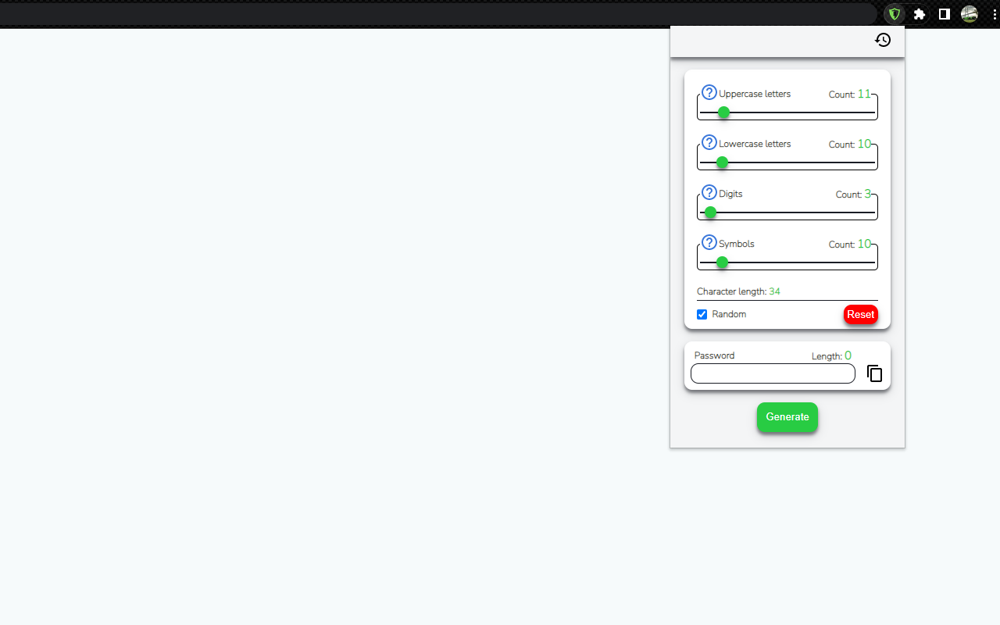

## Strong Password Generator

## Table of contents

- [Overview](#overview)
  - [The features](#the-challenge)
  - [Screenshot](#screenshot)
  - [Links](#links)
- [Built with](#built-with)
- [Author](#author)

## Overview

### The features

- Easy to use.
- Generate up to 400 character long random password including uppercase letters, lowercase letters, digits and symbols.
- You can choose the count of uppercase letters, lowercase letters, digits and symbols. 
- The generated password is editable.
- Choose to save or unsave the generated passwords in the history log.
- One click copy to your clipboard
- Allows to select and delete or copy all passwords in the history log
- Shows real time copied date of the generated passwords in the history log 

### Screenshot

### Links

- Live Site URL: [Add live site URL here](https://your-live-site-url.com)

### Built with

- Semantic HTML5 markup
- Flexbox
- Mobile-first workflow
- [React](https://reactjs.org/) - JS library
- Chrome API

## Author

- Frontend Mentor - [@Vali-Ruziboev](https://www.frontendmentor.io/profile/Vali-Ruziboev)
- Instagram - [valiruziboev](https://www.instagram.com/valiruziboev/)
- Linkedin - [Vali Ruziboev](https://www.linkedin.com/in/vali-ruziboev/)